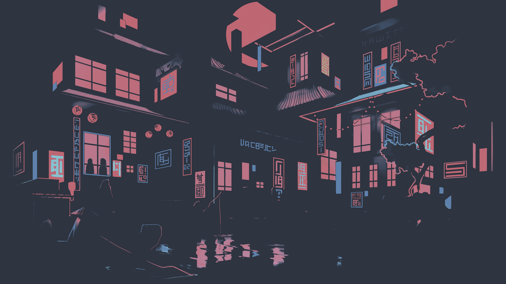
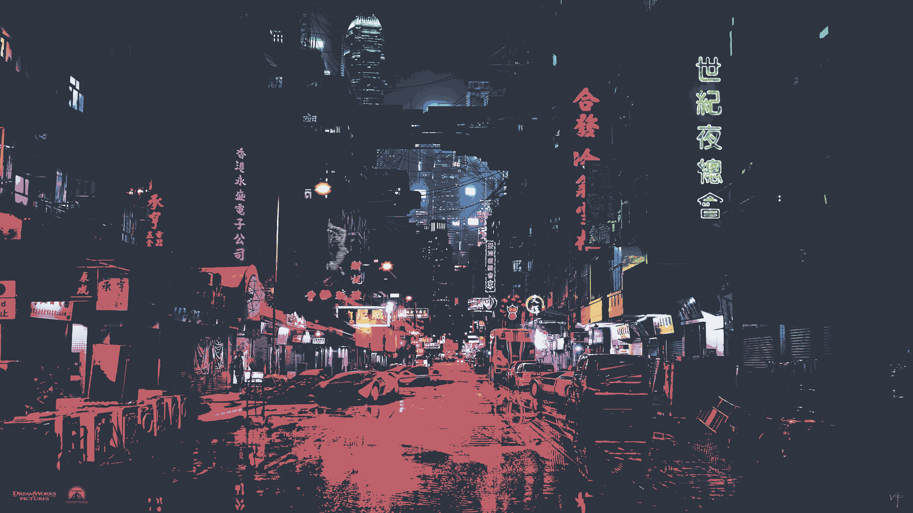
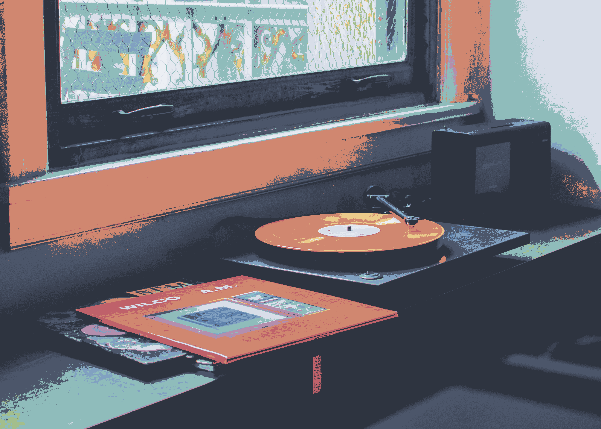

# nordify

Recolor images using the Nord palette & more.

Consequence of a slight infatuation with the glorious Nord palette.

# Features

- [x] Palette based coloring.
- [x] Supports .PNG images.
- [x] Uses CIELAB color distance instead of raw RGB distance for better
      perceptual accuracy.
- [x] Choose from several available palettes.
- [x] Uses goroutines for better performance.
- [ ] Implement Floyd-Steinberg dithering.
- [ ] Support more image formats.

# Showcase

| Original                           | Nordified                                |
| ---------------------------------- | ---------------------------------------- |
|       |       |
|  |  |
|     |     |
|    |    |

# Requirements

This app is packaged using [Nix](https://nixos.org/download).

# Usage

## Run with Nix

```bash
nix run github:sotormd/nordify -- input.png output.png
```

## Build with Go

1. Clone the repository
   ```bash
   git clone https://github.com/sotormd/nordify
   cd nordify
   ```

2. Build and run
   ```bash
   go build ./cmd/nordify
   ./nordify input.png output.png
   ```

# Palettes

Palettes are JSON arrays of hex color codes

The following are included by default:

- nord
- gruvbox
- catppuccin-mocha
- everforest
- dracula
- tokyo-night
- rose-pine
- solarized-dark
- monokai

The palette to use can be specified with the `-p` flag.

```bash
nix run github:sotormd/nordify -- -p everforest input.png output.png
```

The default palette is `nord`.

## Using your own palettes

By default, `nordify` looks for palettes in `$HOME/.config/nordify/palettes/`.

You can pass your own directory with the `-d` flag.

```bash
nix run github:sotormd/nordify -- -d /path/to/my/palettes input.png output.png
```

If this directory doesn't exist, `nordify` will create it and populate it with
the default palettes.
