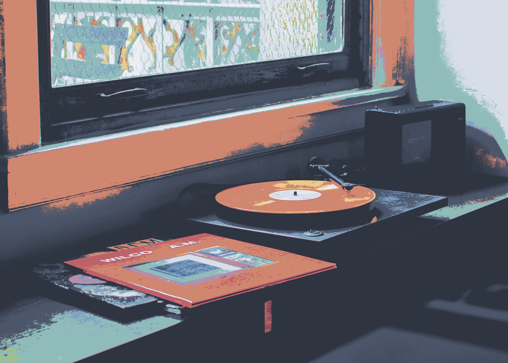

# nordify

Recolor images using the Nord palette & more.

Consequence of a slight infatuation with the glorious Nord palette.

# Features

- [X] Palette based coloring.
- [X] Supports .PNG images.
- [X] Uses CIELAB color distance instead of raw RGB distance for better perceptual accuracy.
- [X] Choose from several available palettes.
- [X] Uses goroutines for better performance.
- [ ] Implement Floyd-Steinberg dithering.
- [ ] Support more image formats.

# Showcase

| Original                              | Nordified                                   |
|---------------------------------------|---------------------------------------------|
|          |          |
|     |     |
|        |        |
|       |       |

# Requirements

This app is packaged using [Nix](https://nixos.org/download).

# Usage

## Run with Nix

1. Clone the repository
    ```
    $ git clone https://github.com/sotormd/nordify
    $ cd nordify
    ```

2. Run
    ```
    $ nix run . -- input.png output.png
    ```

## Build with Go

1. Clone the repository
    ```
    $ git clone https://github.com/sotormd/nordify
    $ cd nordify
    ```

2. Build and run
    ```
    $ go build ./cmd/nordify
    $ ./nordify input.png output.png
    ```

# Palettes

Palettes are JSON arrays in `palettes/<name>.json`

The following are included by default:
- nord
- gruvbox
- cattpuccin-mocha
- everforest
- dracula
- tokyo-night
- rose-pine
- solarized-dark
- monokai

The palette to use can be specified with the `-p` flag.

```
$ nix run . -- -p everforest input.png output.png
```

The default palette is `nord`.

